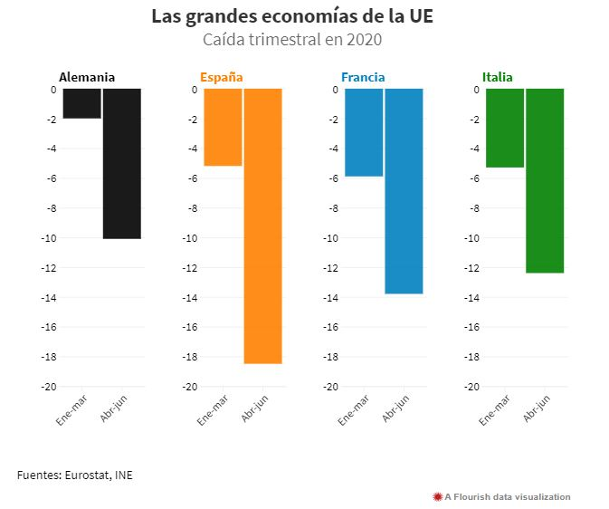

```{r setup, include=FALSE}
htmltools::tagList(rmarkdown::html_dependency_font_awesome())
knitr::opts_chunk$set(echo = T, warning = F, message = F)
```

## {data-background-image='img/cb.png'}

<p class="caption"> Fuente: https://coronavirusnow.artworks.brig.ht/en </p>

## {data-background-image='img/jh.png'}

<p class="caption"> Fuente: https://coronavirus.jhu.edu/map.html </p>

## {data-background-video='img/pais.mov'}

<p class="caption"> Fuente: https://elpais.com/sociedad/2020/06/29/actualidad/1593428011_709853.html </p> 

## El gráfico del PIB


<p style="margin-top:-20px"> Fuente: @planaspa </p>

## ...bien hecho



<p style="margin-top:-20px"> Fuente: @rtve </p>

## 

<h1> Cómo visualizar datos con R </h1>

## Elegir los datos

```{r}
pib_names <- c("Alemania","España","Francia","Italia") 
pib_dates <- factor(rep(c("Ene-mar", "Abr-jun"),each=4),levels=c("Ene-mar", "Abr-jun"))
pib_values <- c(-2,-5.2,-5.9,-5.3, -10.1,-18.5,-13.8,-12.4)
df <- data.frame(pib_names, pib_dates, pib_values)
```


## Elegir la estética

- Variables temporales: Eje X
- Variables numéricas: Eje Y, tamaño, color
- Variables categóricas: Color, forma, aspecto
  - Ordinal: Paleta secuencial
  - Nominal: Paleta cualitativa
  
## Elegir la geometría

- https://ggplot2.tidyverse.org/index.html
- https://github.com/ft-interactive/chart-doctor/tree/master/visual-vocabulary
- https://gganimate.com
- https://jkunst.com/highcharter/index.html
- https://plotly.com/r/

## {data-background-image='img/poster.png'}

<p class="caption"> Fuente: https://github.com/ft-interactive/chart-doctor/tree/master/visual-vocabulary </p>

## Base

```{r}
library(ggplot2)

ggplot(df, aes(x=pib_dates, y=pib_values, fill=pib_names, text=paste0("País:",pib_names,"\n","PIB:",pib_values,"%"))) + 
  geom_col() + 
  facet_grid(~pib_names) + 
  labs(fill="Países de la UE", title="La caída del PIB en la UE", x="1er y 2o trimestre 2020", y="Tasa de variación del PIB") +
  #scale_y_continuous(labels = scales::percent) 
  scale_y_continuous(labels = function(x) paste(x,"%")) -> p
```

## Añadir interactividad

```{r}
p <- p + theme_minimal() + theme(legend.position="none")
library(plotly)
ggplotly(p, tooltip="text")
```

## Dar sentido a los colores

```{r, fig.align="center"}
ggplotly(p +
           scale_fill_manual(values=c("#f7de1e","#e31a1c","#1f78b4","#33a02c")), tooltip="text")
```

## Algo más moderno

```{r, fig.align="center"}
base_palette <- c("#FFD166","#EF476F","#118AB2","#06D6A0") 
ggplotly(p + 
           scale_fill_manual(values=base_palette), tooltip="text")
```

## Destacar la temporabilidad  {data-transition="none"}

```{r, fig.align="center", eval=F}
library(shades)
dark_palette <- saturation(base_palette, 0.1)
temp_palette <- c(rbind(dark_palette, base_palette))
ggplot(df, aes(x=pib_dates, y=pib_values, 
               fill=interaction(pib_dates,pib_names), 
               text=paste0("País:",pib_names,"\n","PIB:",pib_values,"%"))) + 
  geom_col() + 
  facet_grid(~pib_names) + 
  labs(fill="Países de la UE", 
       title="La caída del PIB en la UE", 
       x="", y="Tasa de variación del PIB") +
  scale_y_continuous(labels = function(x) paste(x,"%")) + 
  theme_minimal() +
  scale_fill_manual(values=temp_palette) +
  theme(legend.position = "none") -> p
ggplotly(p, tooltip="text")
```

## Destacar la temporabilidad {data-transition="none"}

```{r, fig.align="center", echo=F}
library(shades)
dark_palette <- saturation(base_palette, 0.1)
temp_palette <- c(rbind(dark_palette, base_palette))

ggplot(df, aes(x=pib_dates, y=pib_values, fill=interaction(pib_dates,pib_names), text=paste0("País:",pib_names,"\n","PIB:",pib_values,"%"))) + 
  geom_col() + 
  facet_grid(~pib_names) + 
  labs(fill="Países de la UE", title="La caída del PIB en la UE", 
       x="", y="Tasa de variación del PIB") +
  scale_y_continuous(labels = function(x) paste(x,"%")) + 
  theme_minimal() +
  scale_fill_manual(values=temp_palette) +
  theme(legend.position = "none") -> p
ggplotly(p, tooltip="text")
```

## Elegir los colores

- Generate in RStudio a palette: colorscale::addin_color_scale()
- Trending Palettes: https://coolors.co/palettes/trending
- Color Brewer: https://colorbrewer2.org/
- Viridis: http://hughjonesd.github.io/tweaking-colours-with-the-shades-package.html
- R Palettes Universe: https://github.com/EmilHvitfeldt/r-color-palettes/blob/master/type-sorted-palettes.md
- Shades: http://hughjonesd.github.io/tweaking-colours-with-the-shades-package.html

## Transmitir el mensaje  {data-transition="none"}

```{r,  fig.align="center", eval=F}
library(highcharter)

series <- df %>% 
   group_by(pib_names) %>% 
   do(data = list(sequence = .$pib_values)) %>% 
   ungroup() %>% 
   group_by(pib_names) %>% 
   do(data = .$data) %>%
   mutate(name = pib_names) %>%
   list_parse()

highchart() %>%
  hc_chart(type = "column") %>%
  hc_add_series_list(series) %>%
  hc_yAxis(max=0, min=-20) %>%
  hc_xAxis(labels=list(enabled=F), tickColor='#fff', tickLength=40) %>%
  hc_colors(colors = base_palette) %>%
  hc_title(text="La caída del PIB en la UE") %>%
  hc_subtitle(text="% Tasa de variación del PIB") %>%
  hc_tooltip(headerFormat = "") %>% 
  hc_yAxis(labels = list(format = "{value}%")) %>%
  hc_motion(
    enabled = TRUE, 
    labels = c(pib_dates %>% levels()), 
    autoplay = TRUE,
    series = seq(0,3,1))
```

## Transmitir el mensaje {data-transition="none"}

```{r, fig.align="center", echo=F}
library(highcharter)

series <- df %>% 
   group_by(pib_names) %>% 
   do(data = list(sequence = .$pib_values)) %>% 
   ungroup() %>% 
   group_by(pib_names) %>% 
   do(data = .$data) %>%
   mutate(name = pib_names) %>%
   list_parse()

highchart() %>%
  hc_chart(type = "column", options3d=list(enabled=TRUE, alpha=15, beta=15, viewDistance=80, depth=50)) %>%
  hc_plotOptions(series=list(pointWidth=50)) %>%
  hc_add_series_list(series) %>%
  hc_yAxis(max=0, min=-20) %>%
  hc_xAxis(labels=list(enabled=F), tickColor='#fff', tickLength=40) %>%
  hc_colors(colors = base_palette) %>%
  hc_title(text="La caída del PIB en la UE") %>%
  hc_subtitle(text="% Tasa de variación del PIB") %>%
  hc_tooltip(headerFormat = "") %>% 
  hc_yAxis(labels = list(format = "{value}%")) %>%
  hc_add_theme(hc_theme_darkunica()) %>%
  hc_motion(
    enabled = TRUE, 
    labels = c(pib_dates %>% levels()), 
    autoplay = TRUE,
    series = seq(0,3,1))
```

## 

<h1> En resumen...</h1>

##

1. Público
2. Dato
3. Formato
4. Ética
5. Mensaje

## Recursos

- Libros y charlas sobre visualización de datos
  - https://www.datanalytics.com/libro_r/introduccion-a-ggplot2.html
  - http://citeseerx.ist.psu.edu/viewdoc/download?doi=10.1.1.129.3922&rep=rep1&type=pdf
  - https://rkabacoff.github.io/datavis/index.html
  - https://www.ted.com/talks/hans_rosling_the_best_stats_you_ve_ever_seen


- Visualizaciones de datos del COVID-19
  - https://dataveyes.com/en
  - https://coronavirus.jhu.edu/map.html
  - https://elpais.com/sociedad/2020/06/29/actualidad/1593428011_709853.html
  - https://www.covid19virusdata.com
  - https://coronavirusnow.artworks.brig.ht/en


## 

<h1> Gracias </h1>
<h2> 😉</h2>

@paulalcasado
